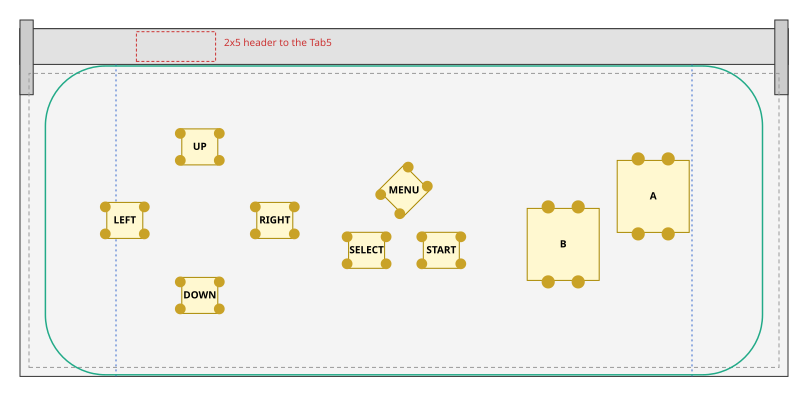
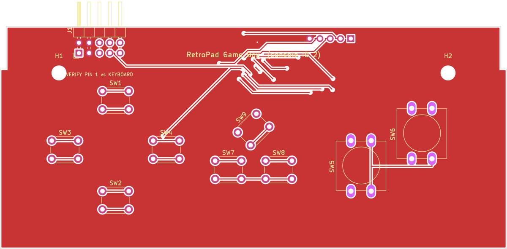
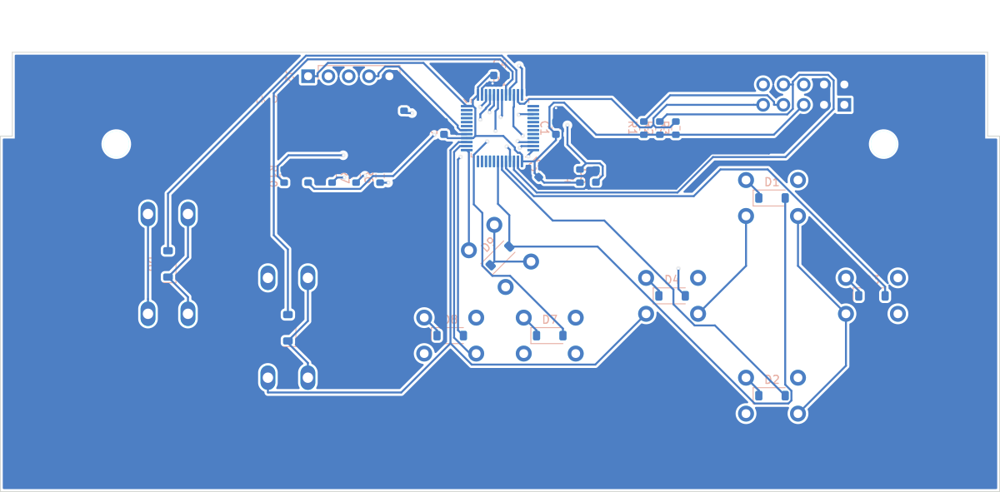
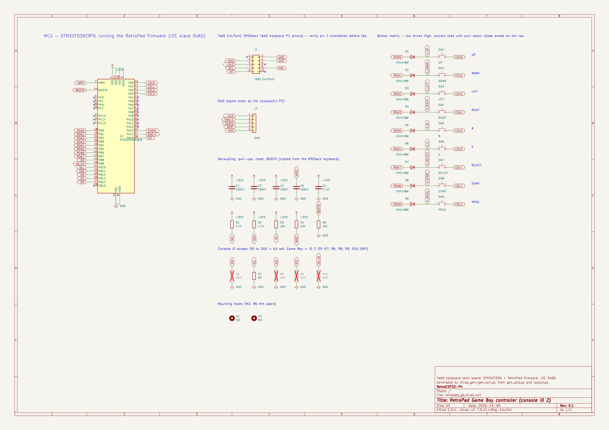

# Game Boy board (console ID 2)

The coordinate conventions, case outline and markings are the same as on the
[SNES board](../snes/README.md). The d-pad uses the SNES board's positions so all boards feel
the same.

## Layout

* **B and A:** on the Game Boy's diagonal, with B low-left and A high-right (15 mm apart across, 8 mm up).
* **SELECT / START:** flat. They were first drawn at the Game Boy's angle, but at 45° the router could not reach the SELECT diode (ROW7); flat, the board routes completely.
* **MENU:** centred above SELECT/START.
* **Shared with NES:** the Game Boy and Game Boy Color use the same core and the same buttons as the NES board, so either board works with either core. The console ID only decides how the host labels and maps the board.

| Button | RetroPad bit | x | y | Switch | Rotation |
|---|---|---|---|---|---|
| UP | `RP_BTN_UP` | 29.97 | 38.25 | 6x6 | 0° |
| DOWN | `RP_BTN_DOWN` | 29.97 | 13.50 | 6x6 | 0° |
| LEFT | `RP_BTN_LEFT` | 17.47 | 26.00 | 6x6 | 0° |
| RIGHT | `RP_BTN_RIGHT` | 42.47 | 26.00 | 6x6 | 0° |
| B | `RP_BTN_B` | 90.53 | 22.00 | 12x12 | 90° |
| A | `RP_BTN_A` | 105.53 | 30.00 | 12x12 | 90° |
| SELECT | `RP_BTN_SELECT` | 57.77 | 21.02 | 6x6 | 0° |
| START | `RP_BTN_START` | 70.22 | 21.02 | 6x6 | 0° |
| MENU | `RP_BTN_MENU` | 64.00 | 31.00 | 6x6 | 45° |

Clearance check (`python3 ../layout.py gb`): extent x 14.2..111.5, y 10.5..41.2; closest bodies 3.00 mm; closest pads 2.66 mm; inside wall margin: True; side buttons below latch arms: True.

Console-ID straps: fit R7 (0 Ω), leave the others unfitted. Every board carries all five
strap footprints.

## PCB and schematic

[`kicad/`](kicad) holds a complete KiCad project (`retropad_gb.kicad_pro`): a schematic, a
routed two-layer PCB, a BOM and the DRC report.

| Check | Result |
|---|---|
| DRC | 0 unconnected pads, no clearance/short/edge errors (silkscreen warnings only) |
| Routing | 357 track segments, 24 vias, GND pour on both layers |
| Schematic vs PCB | 35 schematic nets, 35 PCB nets, 0 differences |

| Front | Back (seen from the back) |
|---|---|
|  |  |

The MCU section, support parts, J1 header and the
[pre-order checklist](../README.md#before-ordering-any-board) are shared with every board.
