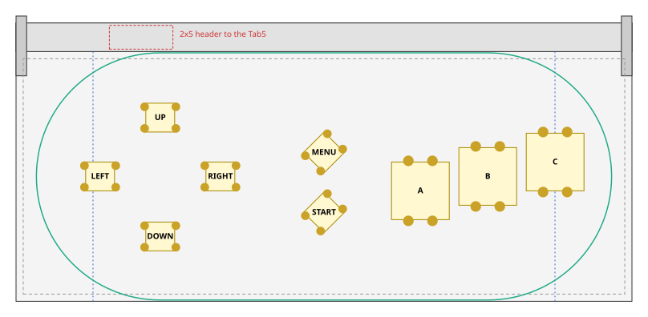
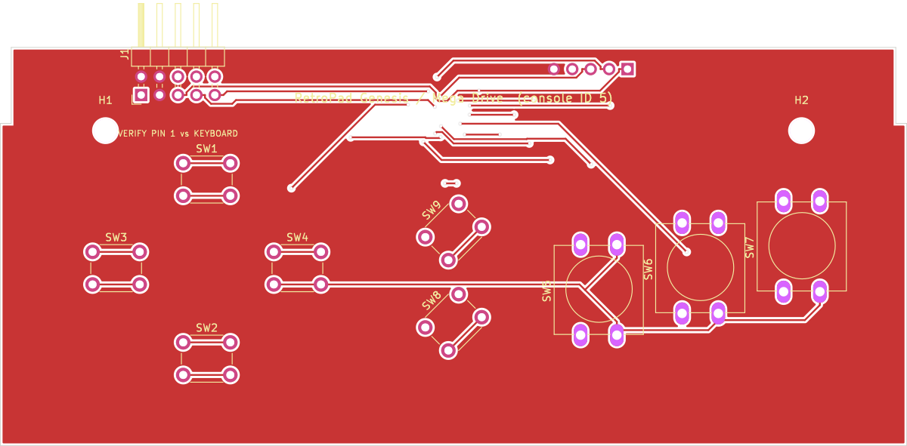
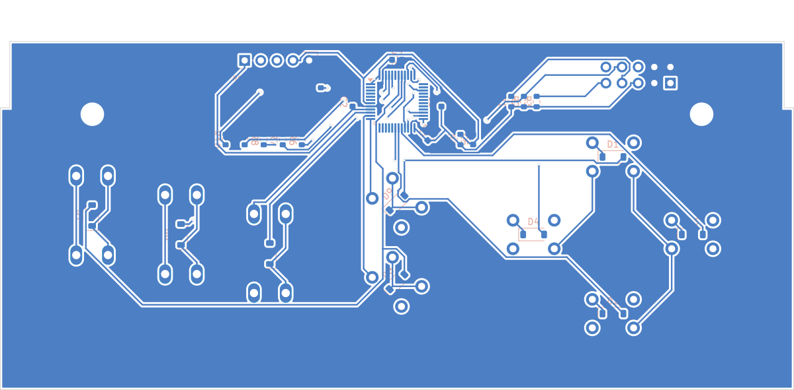
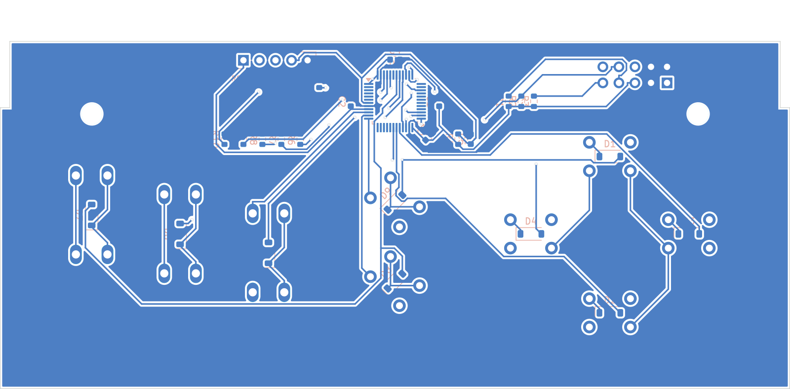

# Genesis / Mega Drive board (console ID 5)

The coordinate conventions, case outline and markings are the same as on the
[SNES board](../snes/README.md). The d-pad uses the SNES board's positions so all boards feel
the same.

## Layout

* **A, B, C:** a row rising to the right (14 mm apart, +3 mm per step), like the 3-button pad. The host maps them for the Genesis core: A → pad A, B → pad B, C → pad C (`s_rp_map_genesis` in `odroid_input.c`).
* **START:** centred, 2.5 mm lower than on the SNES board so it clears MENU.
* **MENU:** centred above START.
* **No MODE / X / Y / Z:** the core is 3-button. The X/Y/Z bits already exist in the protocol, so a 6-button board only needs the core to read them.

| Button | RetroPad bit | x | y | Switch | Rotation |
|---|---|---|---|---|---|
| UP | `RP_BTN_UP` | 29.97 | 38.25 | 6x6 | 0° |
| DOWN | `RP_BTN_DOWN` | 29.97 | 13.50 | 6x6 | 0° |
| LEFT | `RP_BTN_LEFT` | 17.47 | 26.00 | 6x6 | 0° |
| RIGHT | `RP_BTN_RIGHT` | 42.47 | 26.00 | 6x6 | 0° |
| A | `RP_BTN_A` | 84.03 | 23.00 | 12x12 | 90° |
| B | `RP_BTN_B` | 98.03 | 26.00 | 12x12 | 90° |
| C | `RP_BTN_C` | 112.03 | 29.00 | 12x12 | 90° |
| START | `RP_BTN_START` | 64.00 | 18.52 | 6x6 | 45° |
| MENU | `RP_BTN_MENU` | 64.00 | 31.00 | 6x6 | 45° |

Clearance check (`python3 ../layout.py genesis`): extent x 14.2..118.0, y 10.5..41.2; closest bodies 2.00 mm; closest pads 3.11 mm; inside wall margin: True; side buttons below latch arms: True.

Console-ID straps: fit R6, R8 (0 Ω), leave the others unfitted. Every board carries all five
strap footprints.

## PCB and schematic

[`kicad/`](kicad) holds a complete KiCad project (`retropad_genesis.kicad_pro`): a schematic, a
routed two-layer PCB, a BOM and the DRC report.

| Check | Result |
|---|---|
| DRC | 0 unconnected pads, no clearance/short/edge errors (silkscreen warnings only) |
| Routing | 358 track segments, 27 vias, GND pour on both layers |
| Schematic vs PCB | 35 schematic nets, 35 PCB nets, 0 differences |

| Front | Back (seen from the back) |
|---|---|
|  |  |

The MCU section, support parts, J1 header and the
[pre-order checklist](../README.md#before-ordering-any-board) are shared with every board.
