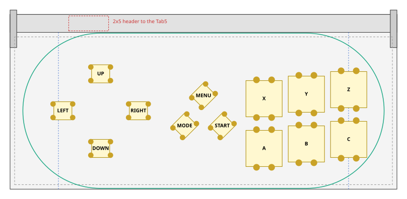
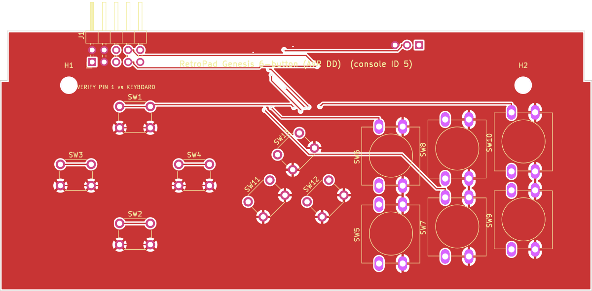
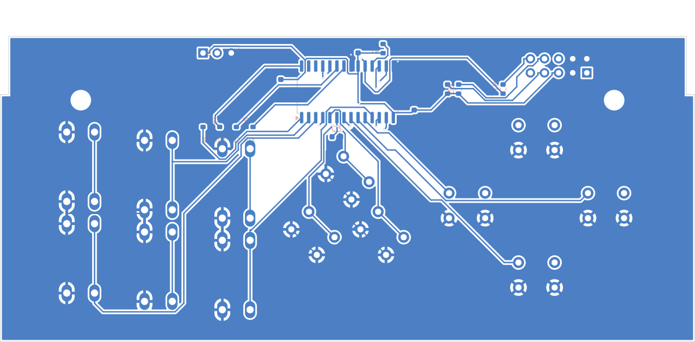
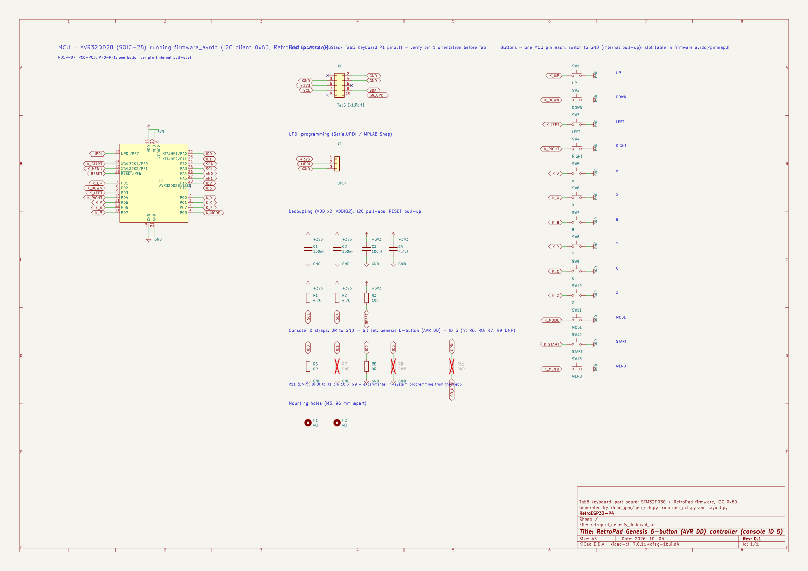

# Genesis / Mega Drive 6-button board, AVR DD version (console ID 5)

The [Genesis / Mega Drive 6-button board](../genesis/README.md) built on the **AVR32DD28-I/SO** core, the same as the
[SNES AVR DD prototype](../snes_dd/README.md): one MCU pin per button, no diodes, UPDI
programming, and the same firmware ([`firmware_avrdd`](../../firmware_avrdd)), which picks this
board's pin map from its console-ID straps.

The layout, outline, M3 holes and 2×5 Tab5 header are identical to the STM32 version. The
MCU pin plan (I2C, straps, analog, UPDI, power) is the same as on the
[SNES AVR DD board](../snes_dd/README.md#mcu-pins).

## Button pins

| Port | MCU pin | Button | RetroPad bit |
|---|---|---|---|
| PD1 | 7 | UP | `RP_BTN_UP` |
| PD2 | 8 | DOWN | `RP_BTN_DOWN` |
| PD3 | 9 | LEFT | `RP_BTN_LEFT` |
| PD4 | 10 | RIGHT | `RP_BTN_RIGHT` |
| PD5 | 11 | A | `RP_BTN_A` |
| PD6 | 12 | X | `RP_BTN_X` |
| PD7 | 13 | B | `RP_BTN_B` |
| PC0 | 2 | Y | `RP_BTN_Y` |
| PC1 | 3 | C | `RP_BTN_C` |
| PC2 | 4 | Z | `RP_BTN_Z` |
| PC3 | 5 | MODE | `RP_BTN_SELECT` |
| PF0 | 16 | START | `RP_BTN_START` |
| PF1 | 17 | MENU | `RP_BTN_MENU` |

All 13 slots are used. MODE is on the SELECT bit, as on the STM32 Genesis board, and X/Y/Z/MODE reach games through the gwenesis 6-button support in https://github.com/shadowlab/RetroESP32-P4_m5StackTab5/pull/4.

Console-ID straps: ID0 (R6) and ID2 (R8) fitted; ID1 and ID3 unfitted.

## Layout

| Button | RetroPad bit | x | y | Switch | Rotation |
|---|---|---|---|---|---|
| UP | `RP_BTN_UP` | 29.97 | 38.25 | 6x6 | 0° |
| DOWN | `RP_BTN_DOWN` | 29.97 | 13.50 | 6x6 | 0° |
| LEFT | `RP_BTN_LEFT` | 17.47 | 26.00 | 6x6 | 0° |
| RIGHT | `RP_BTN_RIGHT` | 42.47 | 26.00 | 6x6 | 0° |
| A | `RP_BTN_A` | 84.03 | 13.50 | 12x12 | 90° |
| X | `RP_BTN_X` | 84.03 | 30.00 | 12x12 | 90° |
| B | `RP_BTN_B` | 98.03 | 15.00 | 12x12 | 90° |
| Y | `RP_BTN_Y` | 98.03 | 31.50 | 12x12 | 90° |
| C | `RP_BTN_C` | 112.03 | 16.50 | 12x12 | 90° |
| Z | `RP_BTN_Z` | 112.03 | 33.00 | 12x12 | 90° |
| MODE | `RP_BTN_SELECT` | 57.77 | 21.02 | 6x6 | 45° |
| START | `RP_BTN_START` | 70.22 | 21.02 | 6x6 | 45° |
| MENU | `RP_BTN_MENU` | 64.00 | 31.00 | 6x6 | 45° |

Clearance check: extent x 14.2..118.0, y 7.2..41.2; closest bodies 2.00 mm; closest pads 1.80 mm; courtyards 0.48 mm; M3 holes 0.54 mm; inside wall margin: True; side buttons below latch arms: True.

## PCB and schematic

[`kicad/`](kicad) holds a complete KiCad project (`retropad_genesis_dd.kicad_pro`): a schematic, a
routed two-layer PCB, a BOM and the DRC report.

| Check | Result |
|---|---|
| DRC | 0 unconnected pads, no clearance/short/edge/courtyard errors (silkscreen warnings only) |
| Routing | 301 track segments, 15 vias |
| Schematic vs PCB | 26 schematic nets, 26 PCB nets, 0 differences |
| Board vs firmware | every switch is on the MCU pin `firmware_avrdd/pinmap.h` assigns it, unused slots are unconnected, and the straps read ID 5 |

| Front | Back (seen from the back) |
|---|---|
|  |  |

The [pre-order checklist](../README.md#before-ordering-any-board) applies: J1 orientation and
height, the M3 holes and the latch notch. Not yet built or run on hardware.
