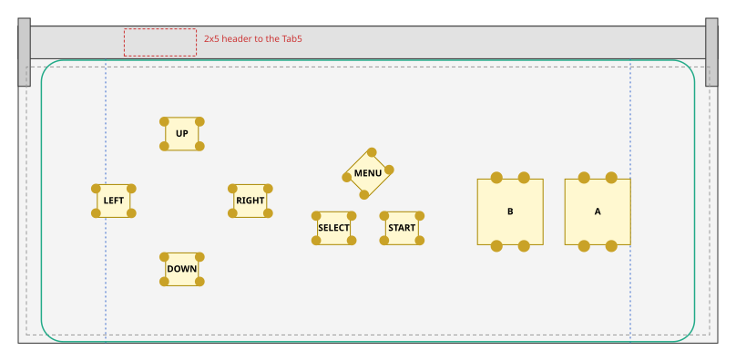
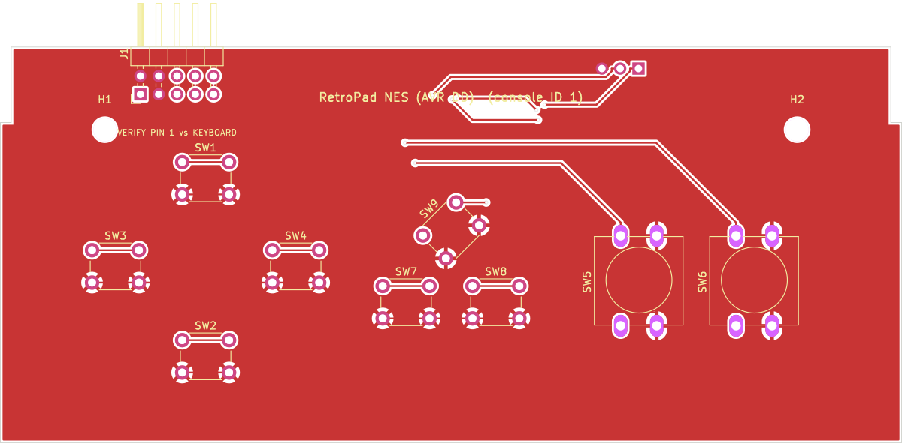
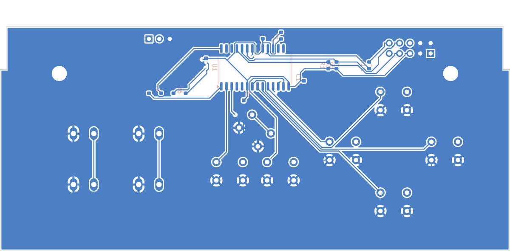
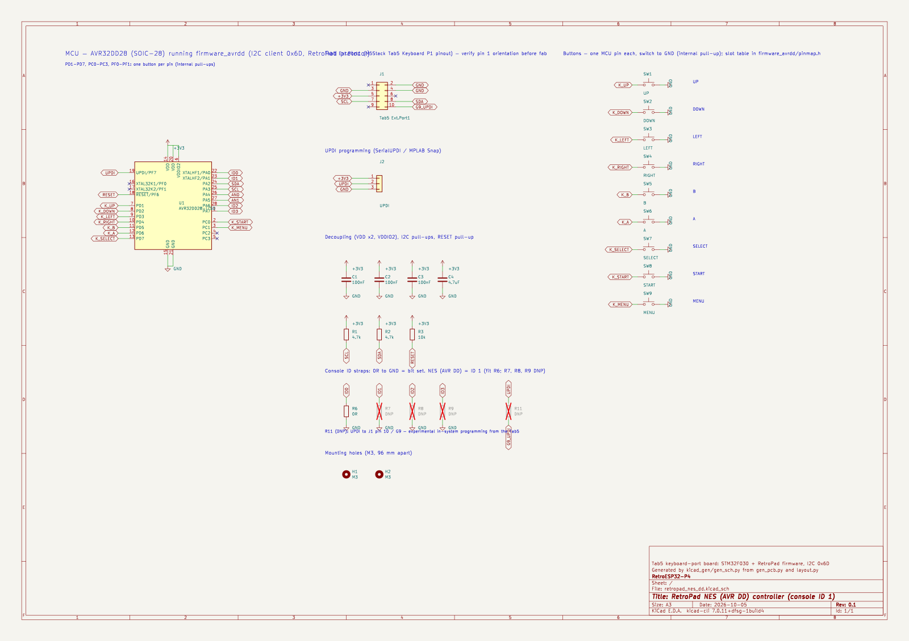

# NES board, AVR DD version (console ID 1)

The [NES board](../nes/README.md) built on the **AVR32DD28-I/SO** core, the same as the
[SNES AVR DD prototype](../snes_dd/README.md): one MCU pin per button, no diodes, UPDI
programming, and the same firmware ([`firmware_avrdd`](../../firmware_avrdd)), which picks this
board's pin map from its console-ID straps.

The layout, outline, M3 holes and 2×5 Tab5 header are identical to the STM32 version. The
MCU pin plan (I2C, straps, analog, UPDI, power) is the same as on the
[SNES AVR DD board](../snes_dd/README.md#mcu-pins).

## Button pins

| Port | MCU pin | Button | RetroPad bit |
|---|---|---|---|
| PD1 | 7 | UP | `RP_BTN_UP` |
| PD2 | 8 | DOWN | `RP_BTN_DOWN` |
| PD3 | 9 | LEFT | `RP_BTN_LEFT` |
| PD4 | 10 | RIGHT | `RP_BTN_RIGHT` |
| PD5 | 11 | B | `RP_BTN_B` |
| PD6 | 12 | A | `RP_BTN_A` |
| PD7 | 13 | SELECT | `RP_BTN_SELECT` |
| PC0 | 2 | START | `RP_BTN_START` |
| PC1 | 3 | MENU | `RP_BTN_MENU` |

9 of the 13 slots are used. PC2, PC3, PF0 and PF1 are left unconnected.

Console-ID straps: ID0 (R6) fitted; ID1-ID3 unfitted.

## Layout

| Button | RetroPad bit | x | y | Switch | Rotation |
|---|---|---|---|---|---|
| UP | `RP_BTN_UP` | 29.97 | 38.25 | 6x6 | 0° |
| DOWN | `RP_BTN_DOWN` | 29.97 | 13.50 | 6x6 | 0° |
| LEFT | `RP_BTN_LEFT` | 17.47 | 26.00 | 6x6 | 0° |
| RIGHT | `RP_BTN_RIGHT` | 42.47 | 26.00 | 6x6 | 0° |
| B | `RP_BTN_B` | 90.03 | 24.00 | 12x12 | 90° |
| A | `RP_BTN_A` | 106.03 | 24.00 | 12x12 | 90° |
| SELECT | `RP_BTN_SELECT` | 57.77 | 21.02 | 6x6 | 0° |
| START | `RP_BTN_START` | 70.22 | 21.02 | 6x6 | 0° |
| MENU | `RP_BTN_MENU` | 64.00 | 31.00 | 6x6 | 45° |

Clearance check: extent x 14.2..112.0, y 10.5..41.2; closest bodies 4.00 mm; closest pads 2.66 mm; courtyards 0.70 mm; M3 holes 6.25 mm; inside wall margin: True; side buttons below latch arms: True.

## PCB and schematic

[`kicad/`](kicad) holds a complete KiCad project (`retropad_nes_dd.kicad_pro`): a schematic, a
routed two-layer PCB, a BOM and the DRC report.

| Check | Result |
|---|---|
| DRC | 0 unconnected pads, no clearance/short/edge/courtyard errors (silkscreen warnings only) |
| Routing | 243 track segments, 9 vias |
| Schematic vs PCB | 22 schematic nets, 22 PCB nets, 0 differences |
| Board vs firmware | every switch is on the MCU pin `firmware_avrdd/pinmap.h` assigns it, unused slots are unconnected, and the straps read ID 1 |

| Front | Back (seen from the back) |
|---|---|
|  |  |

The [pre-order checklist](../README.md#before-ordering-any-board) applies: J1 orientation and
height, the M3 holes and the latch notch. Not yet built or run on hardware.
