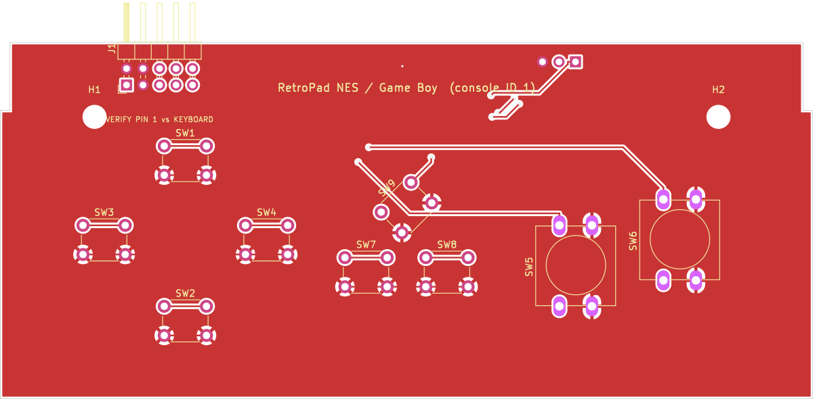
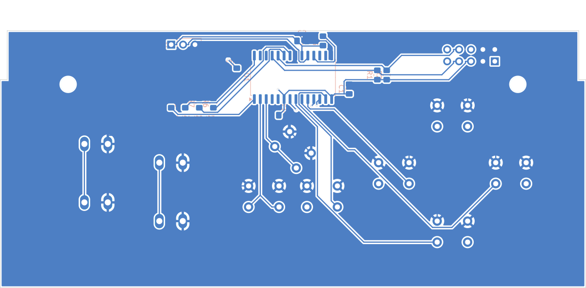

# NES / Game Boy board (console ID 1)

One board for both consoles. The NES pad and the Game Boy have the same buttons (d-pad, B, A,
SELECT, START), and the Tab5 maps them the same way, so the board reports console ID 1 and the
driver names it "NES / Game Boy". ID 2 (Game Boy) stays in the protocol and the firmware maps it
identically, so a board strapped for ID 2 would still work.

The coordinate conventions, case outline and markings are the same as on the
[SNES board](../snes/README.md). The d-pad uses the SNES board's positions so all boards feel
the same.

## Layout

* **B and A:** 12×12 switches 16 mm apart, with A 4 mm higher than B. That slant sits between
  the NES pad's level buttons and the Game Boy's diagonal (8 mm). The switches are turned 90°
  so their pins run vertically, which keeps the two switches' pads well apart.
* **SELECT / START:** flat 6×6 switches, like the NES's rubber pills.
* **MENU:** centred above SELECT/START. It opens the in-game menu.
* **L / R:** none (neither console has shoulder buttons).

| Button | RetroPad bit | x | y | Switch | Rotation |
|---|---|---|---|---|---|
| UP | `RP_BTN_UP` | 29.97 | 38.25 | 6x6 | 0° |
| DOWN | `RP_BTN_DOWN` | 29.97 | 13.50 | 6x6 | 0° |
| LEFT | `RP_BTN_LEFT` | 17.47 | 26.00 | 6x6 | 0° |
| RIGHT | `RP_BTN_RIGHT` | 42.47 | 26.00 | 6x6 | 0° |
| B | `RP_BTN_B` | 90.03 | 22.00 | 12x12 | 90° |
| A | `RP_BTN_A` | 106.03 | 26.00 | 12x12 | 90° |
| SELECT | `RP_BTN_SELECT` | 57.77 | 21.02 | 6x6 | 0° |
| START | `RP_BTN_START` | 70.22 | 21.02 | 6x6 | 0° |
| MENU | `RP_BTN_MENU` | 64.00 | 31.00 | 6x6 | 45° |

Clearance check (`python3 ../layout.py nes_gb`): extent x 14.2..112.0, y 10.5..41.2; closest bodies 4.00 mm; closest pads 2.66 mm; courtyards 0.70 mm; M3 holes 6.25 mm; inside wall margin: True; side buttons below latch arms: True.

Console-ID straps: fit R6 (0 Ω), leave the others unfitted. Every board carries all four
strap footprints (R6–R9).

## PCB and schematic

[`kicad/`](kicad) holds a complete KiCad project (`retropad_nes_gb.kicad_pro`): a schematic, a
routed two-layer PCB, a BOM and the DRC report.

| Check | Result |
|---|---|
| DRC | 0 unconnected pads, no clearance/short/edge/courtyard errors (silkscreen warnings only) |
| Routing | 233 track segments, 4 vias, GND pour on both layers |
| Schematic vs PCB | 21 schematic nets, 21 PCB nets, 0 differences |
| Wiring vs firmware | every switch is on the MCU pin `firmware_avrdd/pinmap.h` gives it for console ID 1 |

Each switch connects its own AVR32DD28 pin to GND (internal pull-up, no diodes):

| Button | MCU pin | RetroPad bit |
|---|---|---|
| UP | PD1 (pin 7) | `RP_BTN_UP` |
| DOWN | PD2 (pin 8) | `RP_BTN_DOWN` |
| LEFT | PD3 (pin 9) | `RP_BTN_LEFT` |
| RIGHT | PD4 (pin 10) | `RP_BTN_RIGHT` |
| B | PD5 (pin 11) | `RP_BTN_B` |
| A | PD6 (pin 12) | `RP_BTN_A` |
| SELECT | PD7 (pin 13) | `RP_BTN_SELECT` |
| START | PC0 (pin 2) | `RP_BTN_START` |
| MENU | PC1 (pin 3) | `RP_BTN_MENU` |

| Front | Back (seen from the back) |
|---|---|
|  |  |

The MCU section (AVR32DD28, decoupling, I2C pull-ups, UPDI header J2), the J1 header and the
[pre-order checklist](../README.md#before-ordering-any-board) are shared with every board; see
[`../../README.md`](../../README.md) §2 for the pin plan.
