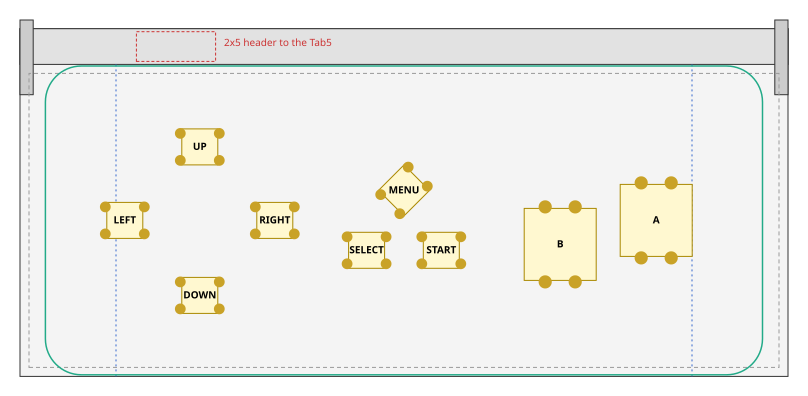
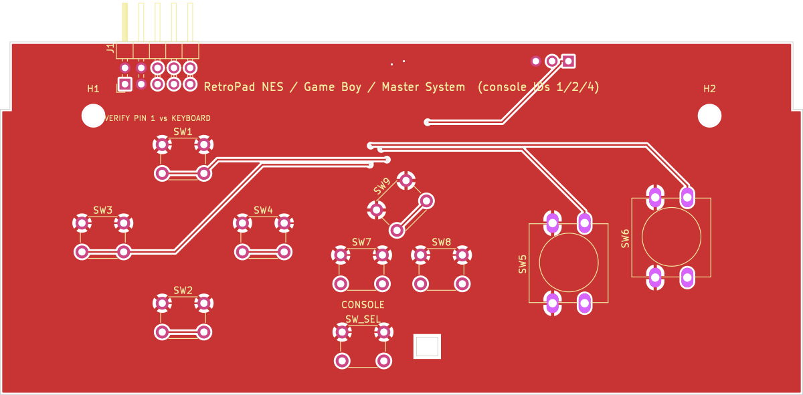
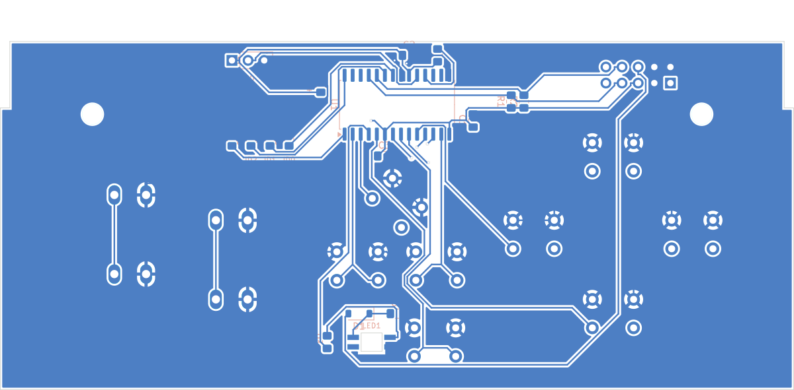
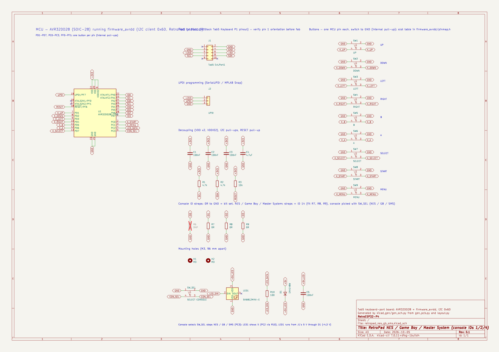

# NES / Game Boy / Master System board (console ID 1, 2 or 4)

One board for three consoles. The NES pad, the Game Boy and the Master System pad all have a
d-pad, two face buttons and START. A CONSOLE button below SELECT/START picks the console the
board reports: NES (ID 1), Game Boy (ID 2) or Master System (ID 4). Each press steps to the next
one, and an RGB LED beside the button shows the choice: red = NES, green = Game Boy,
blue = Master System. The Tab5 then switches the button map and the launcher jumps to that
console's games. The choice is kept across power cycles.

* **Master System:** button 1 is B, button 2 is A, START is START (Pause). SELECT does nothing.
* **CONSOLE button:** a 6×6 tact switch (SW_SEL) on PC3. The ID straps read 14, which tells the
  firmware this is a console-select board (see [Console select](../README.md#console-select)).
* **LED:** an SK6812MINI-E (LED1), mounted on the back and shining through a 3.3 × 2.9 mm cutout
  next to the button. It runs from the Tab5's 5 V on J1 pin 6 through a diode (D1), and its data
  comes from PC2.

The coordinate conventions, case outline and markings are the same as on the
[SNES board](../snes/README.md). The d-pad uses the SNES board's positions so all boards feel
the same.

## Layout

* **B and A:** 12×12 switches 16 mm apart, with A 4 mm higher than B. That slant sits between
  the NES pad's level buttons and the Game Boy's diagonal (8 mm). The switches are turned 90°
  so their pins run vertically, which keeps the two switches' pads well apart.
* **SELECT / START:** flat 6×6 switches, like the NES's rubber pills.
* **MENU:** centred above SELECT/START. It opens the in-game menu.
* **L / R:** none (none of the three consoles has shoulder buttons).

| Button | RetroPad bit | x | y | Switch | Rotation |
|---|---|---|---|---|---|
| UP | `RP_BTN_UP` | 29.97 | 38.25 | 6x6 | 0° |
| DOWN | `RP_BTN_DOWN` | 29.97 | 13.50 | 6x6 | 0° |
| LEFT | `RP_BTN_LEFT` | 17.47 | 26.00 | 6x6 | 0° |
| RIGHT | `RP_BTN_RIGHT` | 42.47 | 26.00 | 6x6 | 0° |
| B | `RP_BTN_B` | 90.03 | 22.00 | 12x12 | 90° |
| A | `RP_BTN_A` | 106.03 | 26.00 | 12x12 | 90° |
| SELECT | `RP_BTN_SELECT` | 57.77 | 21.02 | 6x6 | 0° |
| START | `RP_BTN_START` | 70.22 | 21.02 | 6x6 | 0° |
| MENU | `RP_BTN_MENU` | 64.00 | 31.00 | 6x6 | 45° |

Clearance check (`python3 ../layout.py nes_gb_sms`): extent x 14.2..112.0, y 10.5..41.2; closest bodies 4.00 mm; closest pads 2.66 mm; courtyards 0.70 mm; M3 holes 6.25 mm; inside wall margin: True; side buttons below latch arms: True.

## PCB and schematic

[`kicad/`](kicad) holds a complete KiCad project (`retropad_nes_gb_sms.kicad_pro`): a schematic, a
routed two-layer PCB, a BOM and the DRC report.

| Check | Result |
|---|---|
| DRC | 0 unconnected pads, no clearance/short/edge/courtyard errors (silkscreen warnings only) |
| Routing | 260 track segments, 7 vias, GND pour on both layers, keepout around the LED cutout |
| Schematic vs PCB | 26 schematic nets, 26 PCB nets, 0 differences |
| Wiring vs firmware | every switch is on the MCU pin `firmware_avrdd/pinmap.h` gives it for console IDs 1, 2 and 4; straps read 14; SW_SEL on PC3, LED1 data on PC2 |

Each switch connects its own AVR32DD28 pin to GND (internal pull-up, no diodes). The 4-leg
switches have legs 1–2 on GND and 3–4 on the MCU pin (see [Switches](../README.md#switches)):

| Button | MCU pin | RetroPad bit |
|---|---|---|
| UP | PD1 (pin 7) | `RP_BTN_UP` |
| DOWN | PD2 (pin 8) | `RP_BTN_DOWN` |
| LEFT | PD3 (pin 9) | `RP_BTN_LEFT` |
| RIGHT | PD4 (pin 10) | `RP_BTN_RIGHT` |
| B | PD5 (pin 11) | `RP_BTN_B` |
| A | PD6 (pin 12) | `RP_BTN_A` |
| SELECT | PD7 (pin 13) | `RP_BTN_SELECT` |
| START | PC0 (pin 2) | `RP_BTN_START` |
| MENU | PC1 (pin 3) | `RP_BTN_MENU` |
| CONSOLE (SW_SEL) | PC3 (pin 5) | none; steps the console |
| LED1 data (via R10) | PC2 (pin 4) | none |

| Front | Back (seen from the back) |
|---|---|
|  |  |

The MCU section (AVR32DD28, decoupling, I2C pull-ups, UPDI header J2), the J1 header and the
[pre-order checklist](../README.md#before-ordering-any-board) are shared with every board; see
[`../../README.md`](../../README.md) §2 for the pin plan.
