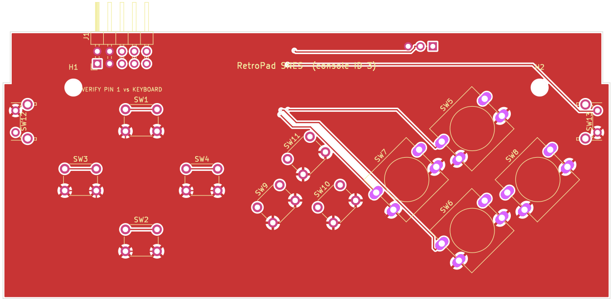
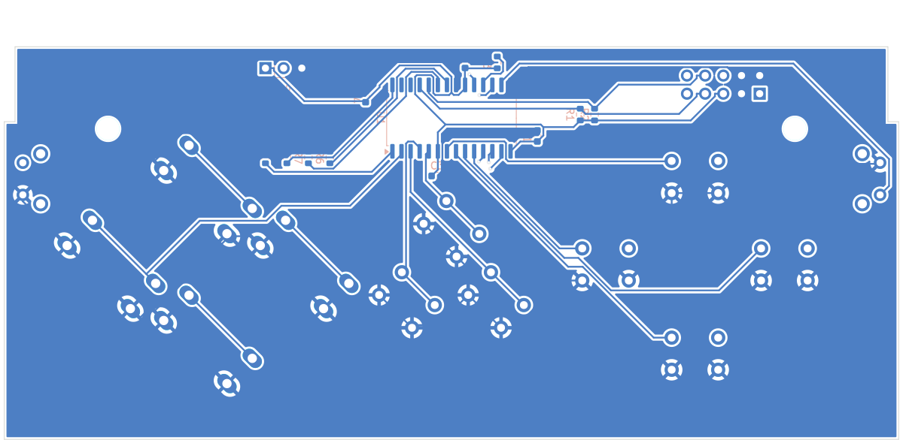
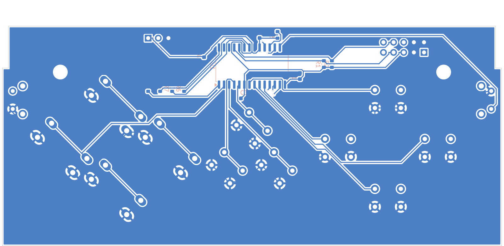

# SNES board (console ID 3)

The layout is derived from the 144 × 62 mm reference drawing (two Ø62 circles 82 mm apart),
fitted inside the Tab5 Keyboard's 128 × 52 mm key area.

Coordinates are in mm, seen from the front: x from the left edge of the case, y up from the
bottom edge. Grey dashes mark an assumed 1.5 mm shell wall. Blue dashes mark the x positions of
the M3 holes. The red box is the 2×5 header, which is on the back side in the top strip. The
grey bars at the top corners are the latch arms. The arrows show where the L/R actuators come
out of the side edges.

## Scaling

The switches stay full size, so scaling the whole drawing evenly pushes them into each other.
At 0.83 the X and B switch bodies would be 0.3 mm apart and the closest pads 0.2 mm apart.
Instead:

* The **outline and the distance between the two clusters** are scaled by **0.83**. The
  clusters move from 82 mm apart to 68.1 mm apart, and the silhouette becomes 119.5 × 51.5 mm.
* **Each cluster keeps the reference spacing:**
  * D-pad: ±12.5 mm left/right, +12.25 mm up, −12.5 mm down.
  * Face buttons: ±13.5 mm left/right, ±10.5 mm up/down.
  * The thumb movements are the same as on the reference pad.
* START/SELECT are scaled with the outline: ±6.2 mm either side of centre, 5.0 mm below the
  centre line.

Result: the buttons span x 1.5–126.5 (the L/R shoulders sit against the side walls) and y
7.0–45.0. The closest switch bodies are 2.8 mm apart (SELECT–START) and the closest pads have
2.5 mm clearance (Y–START). Everything stays inside the wall margin and below the top strip,
and the shoulder buttons sit below the latch arms.

## Placement

| Button | RetroPad bit | x | y | Switch | Rotation |
|---|---|---|---|---|---|
| UP | `RP_BTN_UP` | 29.97 | 38.25 | 6x6 | 0° |
| DOWN | `RP_BTN_DOWN` | 29.97 | 13.50 | 6x6 | 0° |
| LEFT | `RP_BTN_LEFT` | 17.47 | 26.00 | 6x6 | 0° |
| RIGHT | `RP_BTN_RIGHT` | 42.47 | 26.00 | 6x6 | 0° |
| X | `RP_BTN_X` | 98.03 | 36.50 | 12x12 | 45° |
| B | `RP_BTN_B` | 98.03 | 15.50 | 12x12 | 45° |
| Y | `RP_BTN_Y` | 84.53 | 26.00 | 12x12 | 45° |
| A | `RP_BTN_A` | 111.53 | 26.00 | 12x12 | 45° |
| SELECT | `RP_BTN_SELECT` | 57.77 | 21.02 | 6x6 | 45° |
| START | `RP_BTN_START` | 70.22 | 21.02 | 6x6 | 45° |
| MENU | `RP_BTN_MENU` | 64.00 | 31.00 | 6x6 | 45° |
| L | `RP_BTN_L` | 5.00 | 38.00 | 6x6 right-angle | 0° |
| R | `RP_BTN_R` | 123.00 | 38.00 | 6x6 right-angle | 180° |

Each switch goes to its own MCU pin (table under [PCB and schematic](#pcb-and-schematic)).
Fit the console-ID straps R6 and R7 (ID0 and ID1, console ID 3).

**L / R shoulders** are 6×6 right-angle tact switches. They sit at the left and right edges at
y = 38 mm, with the actuators pointing out of the sides of the case. You press them with your
index fingers while holding the Tab5 by its sides. They are placed:

* as high as they can go while staying about 6 mm below the latch arms (which reach about
  11 mm down the sides);
* high enough to keep 2.5 mm pad clearance from A. At y = 34 that clearance was 1.5 mm.

The shell needs an opening in each side wall for the actuator. The footprint in `layout.py` is
generic; replace it with the chosen part's datasheet footprint, which also sets how far the
actuator stands out.

**MENU** is a 6×6 switch centred above SELECT/START (x = 64, y = 31), at the same 45° angle.
It is wired to `RP_BTN_MENU`, which opens the in-game menu. There is no VOLUME button.

The table is generated by `python3 ../layout.py snes`, which also redraws `layout.svg`.
Re-run it after changing the scale or the case numbers.

## Changes from the reference drawing

* **RJ12 connector (J2), 2×20 header and the on-board diodes/resistors:** replaced by the
  RetroPad core: AVR32DD28, 2×5 header to the Tab5, and one MCU pin per switch.
* **L / R shoulders (SW11, SW12):** moved from the top edge, which docks into the Tab5, to the
  side edges.
* **MENU:** added. The reference pad has no menu button.

## PCB and schematic

[`kicad/`](kicad) holds a complete KiCad project (`retropad_snes.kicad_pro`): a schematic, a
routed two-layer PCB, a BOM and the DRC report.

| Check | Result |
|---|---|
| DRC | 0 unconnected pads, no clearance/short/edge/courtyard errors (silkscreen warnings only) |
| Routing | 281 track segments, 5 vias, GND pour on both layers |
| Schematic vs PCB | 25 schematic nets, 25 PCB nets, 0 differences |
| Wiring vs firmware | every switch is on the MCU pin `firmware_avrdd/pinmap.h` gives it for console ID 3 |

Each switch connects its own AVR32DD28 pin to GND (internal pull-up, no diodes):

| Button | MCU pin | RetroPad bit |
|---|---|---|
| UP | PD1 (pin 7) | `RP_BTN_UP` |
| DOWN | PD2 (pin 8) | `RP_BTN_DOWN` |
| LEFT | PD3 (pin 9) | `RP_BTN_LEFT` |
| RIGHT | PD4 (pin 10) | `RP_BTN_RIGHT` |
| X | PD5 (pin 11) | `RP_BTN_X` |
| B | PD6 (pin 12) | `RP_BTN_B` |
| Y | PD7 (pin 13) | `RP_BTN_Y` |
| A | PC0 (pin 2) | `RP_BTN_A` |
| SELECT | PC1 (pin 3) | `RP_BTN_SELECT` |
| START | PC2 (pin 4) | `RP_BTN_START` |
| MENU | PC3 (pin 5) | `RP_BTN_MENU` |
| L | PF0 (pin 16) | `RP_BTN_L` |
| R | PF1 (pin 17) | `RP_BTN_R` |

| Front | Back (seen from the back) |
|---|---|
|  |  |

The MCU section (AVR32DD28, decoupling, I2C pull-ups, UPDI header J2), the J1 header and the
[pre-order checklist](../README.md#before-ordering-any-board) (also in [`kicad/README.md`](kicad/README.md)) are shared with every board; see
[`../../README.md`](../../README.md) §2 for the pin plan.

## Open items

1. The M3 hole height (main README §1). The holes share x with LEFT (x = 16) and A
   (x = 112). They are clear of both if the holes are near y ≈ 45, as the drawing suggests.
2. The latch-arm length down the sides. It is taken from the STL (about 11 mm). If the
   shipping case's arms are longer, lower `SHOULDER_Y` in `layout.py` and re-run.
3. The right-angle switch part for L/R and the matching shell openings. The PCB uses the C&K
   PTS645Vx31 footprint.
4. The 2×5 header's pin-1 orientation and height (see [`kicad/README.md`](kicad/README.md)).
