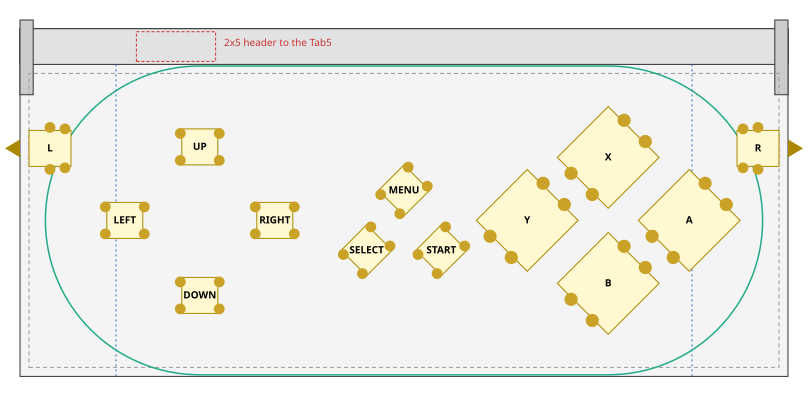
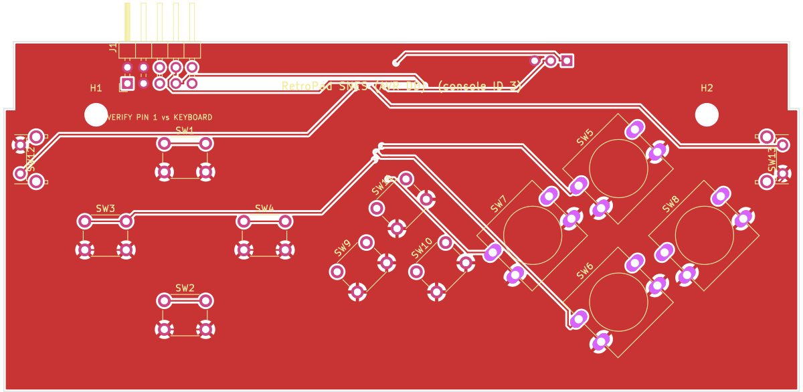
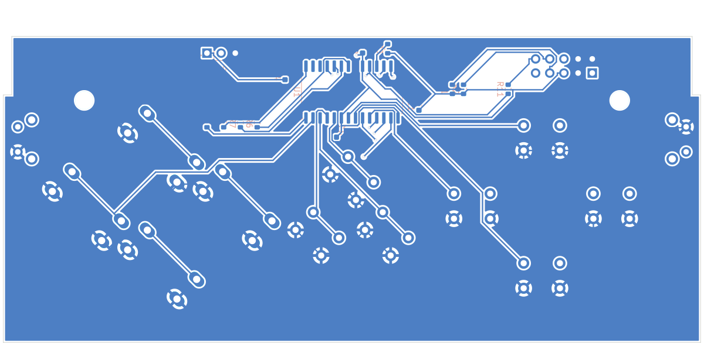
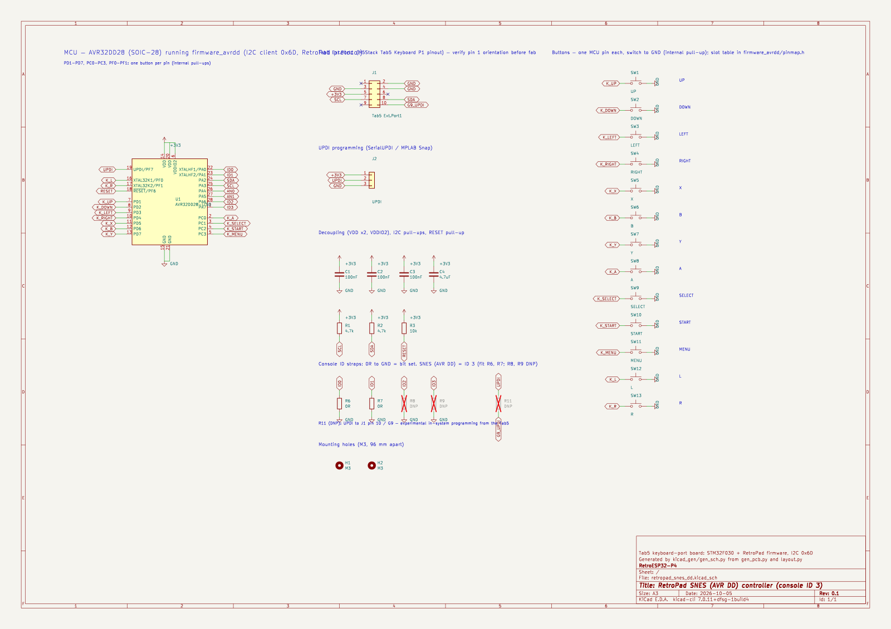

# SNES board, AVR DD version (console ID 3)

A prototype of the [SNES board](../snes/README.md) built around a **Microchip AVR32DD28-I/SO**
(SOIC-28) instead of the STM32F030C8 and its key matrix. Every button has its own MCU pin, so
the 13 matrix diodes are gone. The board programs over **UPDI**.

The button layout, outline, M3 holes and 2×5 Tab5 header are identical to the SNES board, and
so is the I2C protocol. The Tab5 sees an ordinary RetroPad at 0x6D reporting console ID 3, so
the host driver and the emulators need no changes.

## MCU pins

AVR32DD28 SOIC-28 pinout, cross-checked between DxCore's diagram (generated from Microchip's
AVR64DD28 device pack) and KiCad's pin-compatible AVR32DB28 symbol:

| Pin | Port | Use | | Pin | Port | Use |
|---|---|---|---|---|---|---|
| 1 | PA7 | ID3 strap | | 15 | GND | |
| 2 | PC0 | A | | 16 | PF0 | L |
| 3 | PC1 | SELECT | | 17 | PF1 | R |
| 4 | PC2 | START | | 18 | PF6 | RESET (10 k pull-up) |
| 5 | PC3 | MENU | | 19 | PF7 | UPDI |
| 6 | VDDIO2 | 3V3 (supplies PORTC) | | 20 | VDD | 3V3 |
| 7 | PD1 | UP | | 21 | GND | |
| 8 | PD2 | DOWN | | 22 | PA0 | ID0 strap |
| 9 | PD3 | LEFT | | 23 | PA1 | ID1 strap |
| 10 | PD4 | RIGHT | | 24 | PA2 | SDA (TWI0) |
| 11 | PD5 | X | | 25 | PA3 | SCL (TWI0) |
| 12 | PD6 | B | | 26 | PA4 | AN0 (AIN24), unused on SNES |
| 13 | PD7 | Y | | 27 | PA5 | AN1 (AIN25), unused on SNES |
| 14 | VDD | 3V3 | | 28 | PA6 | ID2 strap |

* **Button slots:** the 13 slots (PD1–PD7, PC0–PC3, PF0–PF1) are filled in the order the
  console's layout lists its buttons.
  * `boards/kicad_gen/gen_avrdd_pinmap.py` writes that order into
    [`firmware_avrdd/pinmap.h`](../../firmware_avrdd/pinmap.h).
  * The PCB generator wires the same slots, so one firmware image serves every AVR DD board.
  * A script confirmed that every switch lands on the MCU pin the firmware expects.
* **Not wired:**
  * **INT (header pin 9):** the host driver polls, and the 22nd pin INT would need doesn't
    exist.
  * **AN0/AN1:** no pots on the SNES board.
* **R11 (not fitted):** links UPDI to header pin 10 (Tab5 G9). Fitting it is an experiment
  towards letting the Tab5 reprogram the board; G9's suitability isn't verified.

## Layout

| Button | RetroPad bit | x | y | Switch | Rotation |
|---|---|---|---|---|---|
| UP | `RP_BTN_UP` | 29.97 | 38.25 | 6x6 | 0° |
| DOWN | `RP_BTN_DOWN` | 29.97 | 13.50 | 6x6 | 0° |
| LEFT | `RP_BTN_LEFT` | 17.47 | 26.00 | 6x6 | 0° |
| RIGHT | `RP_BTN_RIGHT` | 42.47 | 26.00 | 6x6 | 0° |
| X | `RP_BTN_X` | 98.03 | 36.50 | 12x12 | 45° |
| B | `RP_BTN_B` | 98.03 | 15.50 | 12x12 | 45° |
| Y | `RP_BTN_Y` | 84.53 | 26.00 | 12x12 | 45° |
| A | `RP_BTN_A` | 111.53 | 26.00 | 12x12 | 45° |
| SELECT | `RP_BTN_SELECT` | 57.77 | 21.02 | 6x6 | 45° |
| START | `RP_BTN_START` | 70.22 | 21.02 | 6x6 | 45° |
| MENU | `RP_BTN_MENU` | 64.00 | 31.00 | 6x6 | 45° |
| L | `RP_BTN_L` | 5.00 | 38.00 | 6x6 right-angle | 0° |
| R | `RP_BTN_R` | 123.00 | 38.00 | 6x6 right-angle | 180° |

Clearance check: extent x 1.5..126.5, y 7.0..45.0; closest bodies 2.80 mm; closest pads 2.53 mm; courtyards 0.88 mm; M3 holes 4.43 mm; inside wall margin: True; side buttons below latch arms: True.

Console-ID straps: R6 and R7 fitted (ID 3), R8 and R9 unfitted.

## PCB and schematic

[`kicad/`](kicad) holds a complete KiCad project (`retropad_snes_dd.kicad_pro`): a schematic, a
routed two-layer PCB, a BOM and the DRC report.

| Check | Result |
|---|---|
| DRC | 0 unconnected pads, no clearance/short/edge/courtyard errors (silkscreen warnings only) |
| Routing | 300 track segments, 10 vias (the STM32 matrix board needs 443 and 26) |
| Schematic vs PCB | 26 schematic nets, 26 PCB nets, 0 differences |

KiCad 7 has no AVR DD symbol. The schematic embeds one derived from the pin-compatible
AVR32DB28, with pins 13/14/15/19 renamed to the DD names (PD7, VDD, GND, UPDI/PF7).

| Front | Back (seen from the back) |
|---|---|
|  |  |

## Compared with the STM32 SNES board

| | STM32F030C8 (matrix) | AVR32DD28 (direct) |
|---|---|---|
| MCU | LQFP-48 | SOIC-28 |
| Diodes | 13 | 0 |
| Programming | SWD (ST-Link) | UPDI |
| Firmware | patch on M5Stack's keyboard firmware, 17 KB | `firmware_avrdd`, ≈1.5 KB |
| Routing | 443 segments, 26 vias | 300 segments, 10 vias |
| Host side | unchanged | unchanged |

The [pre-order checklist](../README.md#before-ordering-any-board) applies here too: J1
orientation and height, the M3 holes and the latch notch.
